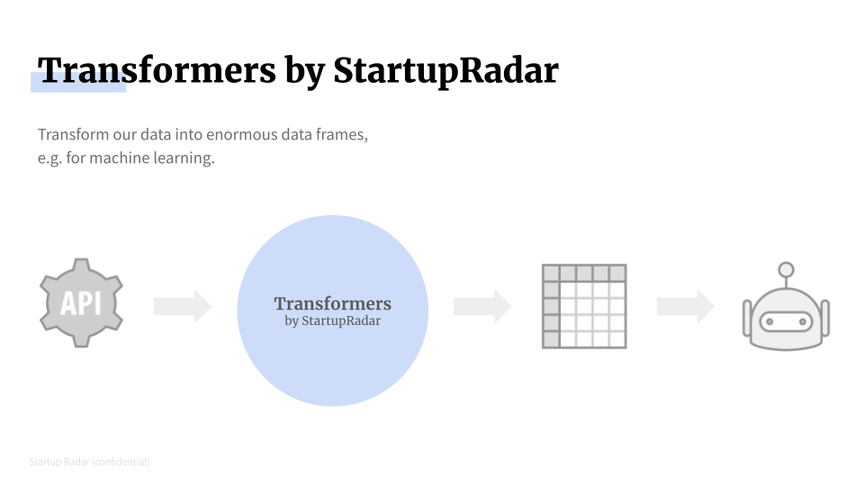

# StartupRadar Transformers

This python package allows you to integrate the [StartupRadar API](https://api.startupradar.co/docs) 
directly into your own Data or Machine Learning pipelines.
With only a list of domains, you can create huge Pandas DataFrames 
filled with all the data available on [StartupRadar](https://startupradar.co).


## Implemented transformers

### startupradar.transformers.export
- Creates a human-readable DataFrame for usage in Excel or Google Spreadsheets (through CSV).

### startupradar.transformers.core
Transformers in this module create data from API functionality. 
All transformers in this module require API access.

- `LinkTransformer`: Create columns for all the domains a given domain links to
- `BacklinkTransformer`: Create columns for all the domains that link to the given domain
- `DomainTextTransformer`: Create a text column with the homepage text of the given domain
- `BacklinkTypeCounter`: Counts the types of pages that link to a specific domain
- `WhoisTransformer`: Add whois-based data to domains (created, updated, expires)
- `SocialsTransformer`: Adds boolean attributes indicating whether a domain has linked social media accounts
  (currently twitter, linkedin, crunchbase, facebook, instagram, and email)

### startupradar.transformers.basic
Transformers in this module work with DataFrames and provide useful feature generation on domains.
The transformers in this module don't require the API and can be used by anyone.

- `DomainNameTransformer`: Extract features from a domain name, currently only top level domain, e.g. `com` or `io`
- `CommonStringTransformer`: Application of a `CountVectorizer` to find common strings among passed inputs
- `ColumnPrefixTransformer`: Create a DataFrame with the same column names, but prefixed with e.g. `prefix_`
- `CounterTransformer`: Create row-wise Counter objects and distribute keys as columns

### startupradar.transformers.pandas
Transformers that re-implement scikit-learn transformers, to also output Pandas DataFrames.
These transformers can be used by anyone, no API key necessary.

- `OneHotEncoderDF`: One Hot Encoder outputting a dense and consistent DataFrame
- `FeatureUnionDF`: Create a FeatureUnion with pd.DataFrames as input and output
- `PipelineDF`: Creates a pipeline that retains DataFrames and their column names
- `TfidfVectorizerDF`: Adaption of the sklearn transformer
- `CountVectorizerDF`: Adaption of the sklearn transformer

### Upcoming
Transformers we're thinking about that may be coming soon:
 
- something to leverage the similar domains endpoint
- tfidf of all backlinks or (forward) links combined (domain- or url-level)

## How it works
For most transformers, you can simply pass a series of domain names as input.
In the case of the DomainNameTransformer, it could look like this:

```shell
> import pandas as pd
> from startupradar.transformers.util import DomainNameTransformer
>
> domains = ["loreyventures.com", "startupradar.co", "karllorey.com"]
> domains_series = pd.Series(domains)
> t = DomainNameTransformer()
> t.fit_transform(domains_series)
                   tld
loreyventures.com  com
startupradar.co     co
karllorey.com      com

```

## Install
This is a work in progress.
You should expect things to change on a daily basis.
If you're still convinced to try it,
feel free to check the latest version by installing it as a git-based dependency:

```shell
> pip install git+https://github.com/startupradar/transformers.git
```